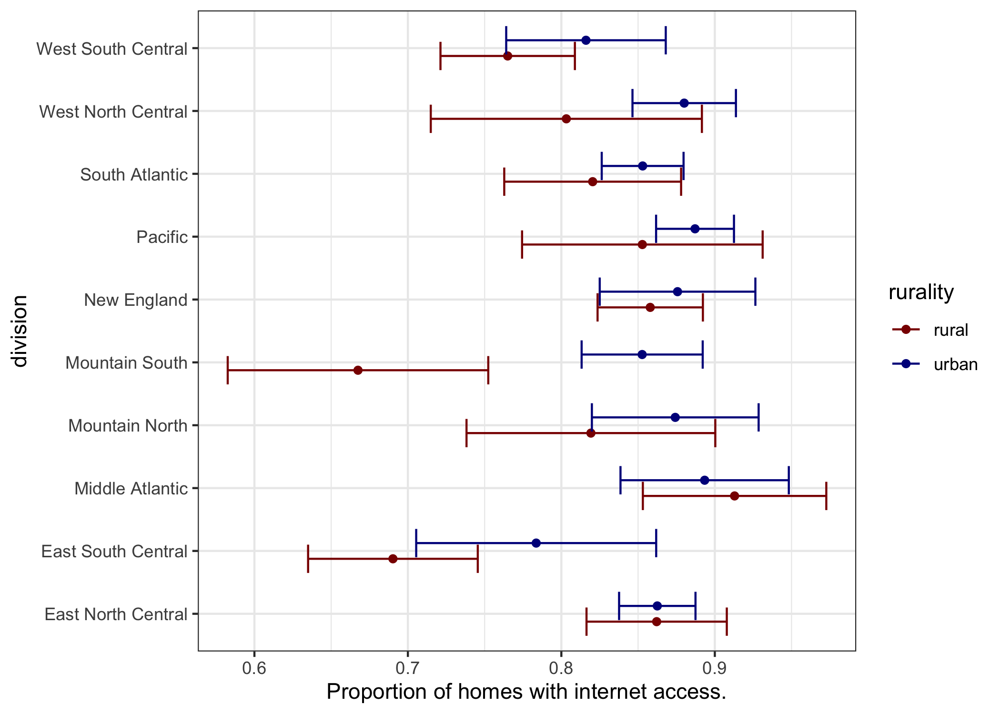
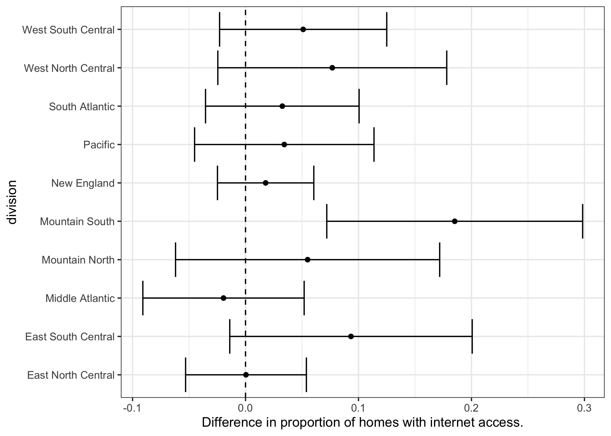

## Week1 - Practice Linux shell skills ##
* Part 0 - Prepare your workspace
* Part 1 - Download RECS and extract columns by name
	* week1_part1.sh 
* Part 2 - Modify the previous script into an executable program.
	* week_part2_args.sh
	* cutnames.sh

## Week2 - R syntax and reasoning activity ##
* Questions

## Week3 - Git and Markdown activity ##
* Part 1
	* Clone States506_public
	* Add & Modify README.md
* Part2 
	* Practice using branches in git

## Week4 - Into the Tidyverse ##
* Part 0 - Git 
* Part 1
	* week4_part1.Rmd
* Part 2
	* week4_part2.Rmd
	* week4_part2.html
	
## Week5 - Catching up ##
* Part 1
	* Finishing week 4 part 2, plots generated below
* Part 2
	* Peer review github

    
    

 
