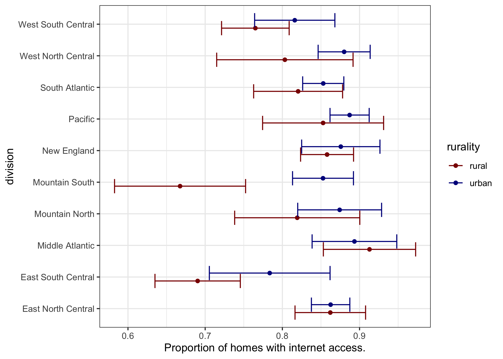

## Groups

This is a group activity. You can view your group
and assigned role at:

https://docs.google.com/spreadsheets/d/1r4OxLjU_oLbVDfyn7y066cc-Qe8HZNBE7zSDRKuoIlY/edit?usp=sharing

If someone is absent, please assign their role to another member of your group.
If you need to switch roles within your group, please edit the "roles" sheet
as needed. This will be the final week in these groups. 

If you see 'chat only' in the notes for a group member, please log into 
your umich Gmail account.  Then, have the project manager open a google chat 
for the group.  On the left-hand menu, click the `+` next to
'chat' and then select 'start a group conversation' and add your group members.
Thank you for your cooperation.

### Roles

**Project Manager** - The person in this role should keep the group on task
by asking questions and making sure each member knows their role.
Set up a Google Chat for the group if any members need to participate by
chat only. Help with other roles as needed.

**Editor** - The person in the Editor role should share their screen with the
group as needed during the breakout sessions to demo key steps for other group
members. 

**Record Keeper** - This person in this role should edit the google sheet 
with your group's progress during the breakout sessions. Update a step to "done"
only *after* everyone in the group has completed the step.  

**Questioner** - The person in the questioner role should be prepared to ask the
group's questions when the class reconvenes as a whole. 

## Week 5 - Catching Up

The direct link to this page is:
https://github.com/jbender/Stats506_F20/tree/master/activities/week5/

### Part 1 (ggplot2)

Let's start by completing part 2 of the week 4 activity. 

In this part of the activity, you will use the summary data includned in this 
repo to reproduce the plot in each question using ggplot. The data represents
summary results from an analysis of the 2015 RECS data comparing the proportion
of homes with internet access by Urban (including Urban Cluster) and Rural
status within each Census Division. 

Use the provided template [week4_part2.Rmd](../week4/week4_part2.Rmd)
to produce your solution. Some preparatory work is done for you to facilitate
plotting, but you may need to make additional changes to the input data 
structure. 

---

1. Here is the plot you are targeting for q1.

---

2. Here is the target plot for q2. 

---

3. Push your results to the `week5` folder of your `Stats506_public` repo. 
   In your README, include the plots you produced using the markdown syntax:
   ``.
   As an alternative, you could also use an html image tag
   ``.
   Your plots should also be pushed to the repo.
   (If you finished this last week, just point to the week 4 folder with a link.)

### Part 2 - Peer Review

In this section, you will utilize the "issues" feature of GitHub to provide
feedback to your peers on the completeness, correctness, and organization of
their `Stats506_public` repo.

For more on peer review see
[here](https://jbhender.github.io/Stats506/F20/peer_review.html).

In the google sheet with roles for this week you will find a link to the
`Stats506_public` repo of a classmate in another group.  Please visit
that page and assess it for items below. When done, open an issue in their
repo with the contents of your review. Use a positive tone in your review. 

1. Completeness
  - Are there links to repos for group members from both weeks 1-3 and 4-6?
  - Is there a folder `activities/week1` with shell scripts from the week 1
    activity?
  - Is there a `week4` folder with a solution to the dplyr (part 1) activity?  
  - Is there a `week5` (or possible `week4`) folder with a solution to
    the ggplot2 activity (part 1 above, or week4 part 2)?
  - Is there a file `activities/README.md` describing the files in the
    `activities` folder?

2. Correctness
  - Are links to other's repos actual, clickable links?
  - Do the `.sh` and `.Rmd` scripts contain actual solutions and
    not only the templates? 

3. Style
  - Do the README.md files use `##` headers for organization?
  - Are there any formatting issues that make the repo hard to
    read?
  - Do scripts identify the classmate as the author? (rather than,
    e.g. Dr. Henderson)
  - Do the scripts use comments well? Are there lines longer than
    79 characters long?

In your review try to emphasize 1-3 items under each header
(completeness, correctness, style) that can be improved. If
everything in a section looks great, it's enough to say so.

